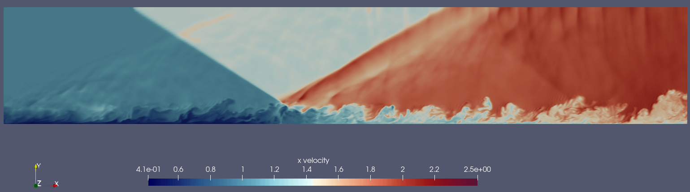
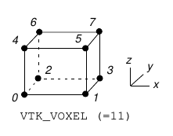

# vtk



 Library for reading and writing vtk files

## Supported Features

* writing XML Rectilinear grids
* Outputting data in both binary and ascii
* Parsing XML rectilinear grids with ascii input
* Adding, subtracting, dividing, and multiplying vtk data together or by constants

## Quickstart

Lets say you have the following struct that you have read in from some CSV file:

```rust
struct VelocityField {
    u: Vec<f64>,
    v: Vec<f64>,
    w: Vec<f64>,
}
```

Lets say we know this data has come from a X/Y/Z grid of 100/100/400 in size, with 1000 divisions 
in each direction. We need to tell `vtk` about the locations of each cell so that they can be 
plotted correctly. We can create, for example, the x locations with a dx of X/1000:

```rust
let x_total = 100.;
let x_divisions = 1000.;
let dx = x_total / x_divisions;

let x_locations: Vec<f64> = std::iter::repeat(0)
    .take(100)
    .enumerate()
    .map(|(x, _)| x as f64 * dx)
    .collect();
```

Once we know all the locations in the x, y, and z directions we map it into a `vtk::Locations`:

```rust
let global_locations = vtk::Locations {
    x_locations: x_locations,
    y_locations: y_locations,
    z_locations: z_locations,
};
```

Then, we need to tell `vtk` for what section of the global locations does this data correspond to. This
is because vtk can combine several different "spans" of information (`LocationSpans`) into a single
flow field. Since we already know the X/Y/Z maximums, and are only making a singular `.vtk` file,
the spans are easy:

```rust
let location_spans = vtk::LocationSpans {
    x_start: 0,
    x_end: 100,
    y_start: 0,
    y_end: 100,
    z_start: 0,
    z_end: 400,
};
```

Lastly, we need to describe to vtk how our `VelocityField` members are going to be actually
written to a file. We can use the built-in `vtk::write_dataarray` function for all of our needs:

```rust
impl vtk::DataArray for VelocityField {
    fn write_inline_dataarrays<W: Write>(
        &self,
    ) -> Result<(), crate::Error> {
        vtk::write_inline_dataarray(writer, &self.u, "u", vtk::Encoding::Base64)?;
        vtk::write_inline_dataarray(writer, &self.v, "v", vtk::Encoding::Base64)?;
        vtk::write_inline_dataarray(writer, &self.w, "w", vtk::Encoding::Base64)?;
        Ok(())
    }
    fn is_appended_array() -> bool {
        false
    }
    fn write_appended_dataarray_headers<W: Write>(
        &self,
        writer: &mut EventWriter<W>,
        starting_offset: i64,
    ) -> Result<(), crate::Error> {
    	Ok(())
    }
    fn write_appended_dataarrays<W: Write>(
        &self,
        writer: &mut EventWriter<W>,
    ) -> Result<(), crate::Error> {
    	Ok(())
    }
}
```

With this, we can combine our file into a `vtk::VtkData` and write it to a file to view in paraview!:

```rust
let velocity_field : VelocityField = ...;

let vtk_file = vtk::VtkData {
    data: velocity_field,
    locations: global_locations,
    spans: location_spans,
};

// make sure to use a write buffer to speed things up
let file = std::io::WriteBuf::new(std::fs::File::create("your_file.vtk").unwrap());
vtk::write_vtk(file, vtk_file).unwrap()
```

### Deriving
The implementation for `DataArray` on all your types can be tedious. If you add a new member to your data struct
you must also remember to add an additional call to `write_dataarray`. Instead, you can add the `derive` feature
to your crate and this trait (along with `vtk::traits::ParseDataArray`) can be automatically generated:

```rust
#[derive(vtk::DataArray, vtk::ParseDataArray)]
struct VelocityField {
    u: Vec<f64>,
    v: Vec<f64>,
    w: Vec<f64>,
}
```

and the following code is automatically generated:

```rust
impl vtk::traits::DataArray for Data {
    fn write_appended_dataarrays<W: std::io::Write>(
        &self,
        writer: &mut vtk::EventWriter<W>,
    ) -> Result<(), vtk::Error> {
        vtk::write_appended_dataarray(writer, &self.u)?;
        vtk::write_appended_dataarray(writer, &self.v)?;
        vtk::write_appended_dataarray(writer, &self.w)?;
        Ok(())
    }
    fn write_appended_dataarray_headers<W: std::io::Write>(
        &self,
        writer: &mut vtk::EventWriter<W>,
        mut offset: i64,
    ) -> Result<(), vtk::Error> {
        vtk::write_appended_dataarray_header(writer, "u", offset)?;
        offset += (std::mem::size_of::<f64>() * self.u.len()) as i64;
        vtk::write_appended_dataarray_header(writer, "v", offset)?;
        offset += (std::mem::size_of::<f64>() * self.v.len()) as i64;
        vtk::write_appended_dataarray_header(writer, "w", offset)?;
        offset += (std::mem::size_of::<f64>() * self.w.len()) as i64;
        Ok(())
    }
}
impl vtk::traits::ParseDataArray for Data {
    fn parse_dataarrays(
        data: &str,
        span_info: &vtk::LocationSpans,
    ) -> Result<Self, vtk::ParseError> {
        let len = span_info.x_len() * span_info.y_len() * span_info.z_len();
        #[allow(unused_variables)]
        let (data, u) = vtk::parse_dataarray(&data, "u", len)?;
        #[allow(unused_variables)]
        let (data, v) = vtk::parse_dataarray(&data, "v", len)?;
        #[allow(unused_variables)]
        let (data, w) = vtk::parse_dataarray(&data, "w", len)?;
        Ok(Self { w, v, u })
    }
}

```

## A note on ordering of data

Since the data is usually ordered in a `Vec<_>` it is ambiguous how `vtk` expects the data to be inputted. This is 
best illustrated code:

```python
data_to_write_vtk = []

for k in range(0, NZ):
    for j in range(0, NY):
        for i in range(0, NX):
	    data_to_write_vtk.append(u_velocity[i,j,k])
```

In other words, iterate though your data in this order: Z, Y, X. This is illustrated for rectilinear systems
in the [paraview VTK file format specification](https://kitware.github.io/vtk-examples/site/VTKFileFormats/):


